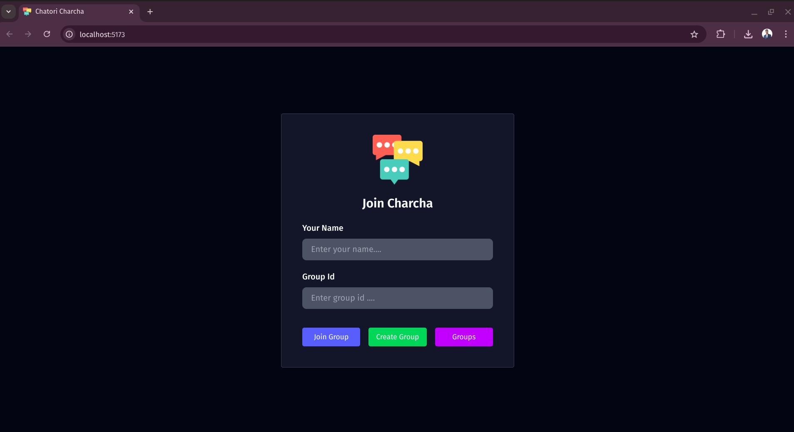
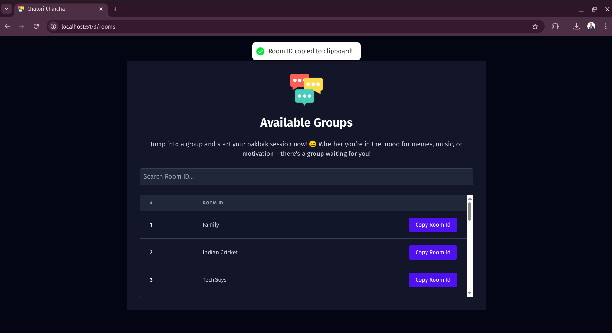
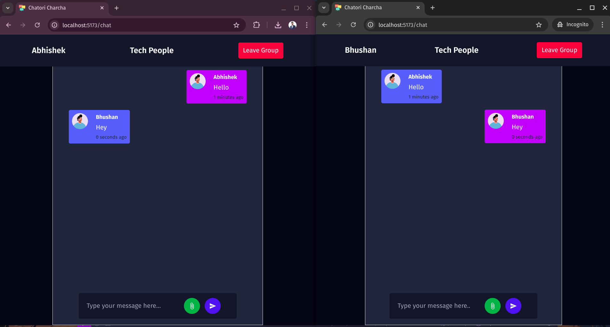

#  Chatori Charcha

Chatori Charcha is a real-time chatroom application where users can randomly join or create chat groups to engage in spontaneous discussions on any topic. It provides a smooth user experience with real-time messaging, room-based discussions, and clean navigation — ideal for anonymous or topic-based group chats.

---

## Table of Contents

- [ Overview](#-overview)
- [ UI Glimpses](#-ui-glimpses)
- [ Features](#-features)
- [ Tech Stack](#-tech-stack)
- [ Architecture](#-architecture)
- [ Backend API Summary](#-backend-api-summary)
- [ MongoDB Schema](#-mongodb-schema)
- [ Setup & Run Locally](#-setup--run-locally)
- [ Author](#-author)

---

## Overview

**Chatori Charcha** enables users to:
- Create or join chatrooms using a unique Room ID.
- View available public rooms and search by keyword.
- Chat with other users in real-time via WebSocket.
- Store and retrieve chat history using MongoDB.

A fun, lightweight, and real-time group chat experience for random and topic-based discussions.

---

##  UI Glimpses


| Home / Join Room                     | Room Listing Page                    | Live Group Chat                        | 
|-------------------------------------|--------------------------------------|----------------------------------------|
|      |     |    |

---

##  Features

-  Join a room using a Room ID
-  Create a new room instantly
-  View and search through all available rooms
-  Copy Room ID with one click
-  Real-time group chat using STOMP over WebSocket
-  Toast notifications for success and feedback
-  Messages and rooms stored persistently in MongoDB

---

##  Tech Stack

| Layer      | Technology Used            |
|------------|-----------------------------|
| Frontend   | React (Vite)                |
| Routing    | React Router            |
| WebSocket  | STOMP.js + SockJS           |
| Backend    | Spring Boot (Java)          |
| Database   | MongoDB                     |
| Toasts     | React Hot Toast             |
| HTTP       | Axios-based service layer   |

---

##  Architecture

A high-level view of how components communicate:

```
  ┌────────────┐       REST API      ┌──────────────┐
  │  Frontend  │  ───────────────▶   │ Spring Boot  │
  │ (React.js) │                    │  Backend     │
  └────────────┘       WebSocket     └──────────────┘
        │     ◀──── STOMP/SockJS ─────▶     │
        │                                ▼
        │                         ┌────────────┐
        └──────────────────────▶ │  MongoDB    │
                                 └────────────┘
```

---

## Backend API Summary

Here are the key REST and WebSocket endpoints exposed by the Spring Boot backend:

| Endpoint                                     | Method | Purpose                                 |
|---------------------------------------------|--------|------------------------------------------|
| `/chat`                                     | WS     | WebSocket handshake endpoint             |
| `/topic/room/{roomId}`                      | SUB    | Subscribe to a specific chat room topic  |
| `/api/v1/rooms`                             | POST   | Create a new chat room                   |
| `/api/v1/rooms`                             | GET    | Fetch list of all available rooms        |
| `/api/v1/rooms/{roomId}`                    | GET    | Join a room using its ID                 |
| `/api/v1/rooms/{roomId}/messages`           | GET    | Get messages (paginated) for a room      |

All HTTP requests use content-type headers where applicable and handle data through a standard Axios-based service layer.

---

##  MongoDB Schema

The app uses MongoDB to persist room and message data. Each room document holds messages within it.

### Room Collection Schema

| Field         | Type       | Description                          |
|---------------|------------|--------------------------------------|
| `_id`         | `String`   | Auto-generated unique identifier     |
| `roomId`      | `String`   | Unique Room ID                       |
| `messages`    | `Array`    | List of message sub-documents        |

### Message Sub-document

| Field       | Type     | Description                          |
|-------------|----------|--------------------------------------|
| `sender`    | `String` | Name or ID of the sender             |
| `content`   | `String` | Actual message content               |
| `timestamp` | `Date`   | Time the message was sent            |

These messages are stored as embedded documents in the corresponding room.

---

##  Setup & Run Locally

###  Frontend (Vite + React)
```bash
cd frontend
npm install
npm run dev
```

### ⚙️ Backend (Spring Boot)
```bash
cd backend
./mvnw spring-boot:run
```

Make sure MongoDB is running locally on default port (27017) or configured via `application.properties`.

---

##  Author

Made with  by **Gawali Abhishek**

- GitHub: [@GawaliAbhishek](https://github.com/GawaliAbhishek)
- Project Repo: [Chatori Charcha](https://github.com/GawaliAbhishek/Chatori-Charcha)

---

> 🎉 Contributions are welcome! Open an issue, fork the repo, or submit a PR to enhance the Charcha.
